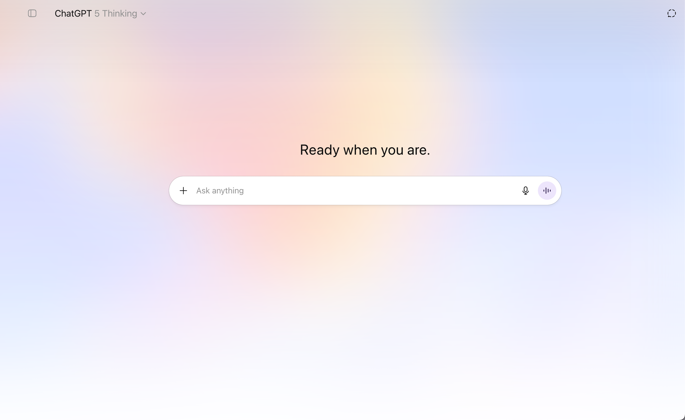

# Ambient Aura for ChatGPT

Ambient aurora background on the ChatGPT home screen with an optional **Legacy composer**. No tracking. Not affiliated with OpenAI.

---

## Preview



Note: Screenshot of the ChatGPT interface used for demonstration purposes. Not affiliated with OpenAI.

---

## Highlights

* 🌌 **Ambient aurora background** — clean pastel glow on the home screen
* 📝 **Legacy composer** — optional fallback to a simpler composer (no glass)
* 🔒 **Private** — no analytics; settings stored via Chrome `storage.sync`

---

## Install (unpacked)

These steps match the Chrome “Hello World” flow you’re used to.

1. **Download** or `git clone` this repo.
2. Open Chrome and go to `chrome://extensions`.
3. Switch **Developer mode** on (top right).
4. Click **Load unpacked** and pick the project folder.
5. Pin the extension from the puzzle icon so its toolbar button shows.
6. Open ChatGPT and enjoy the ambient **aurora**.

Similar to this tutorial "https://developer.chrome.com/docs/extensions/get-started/tutorial/hello-world?hl=en"

---

## Install from Chrome Web Store (coming soon)

This section will be updated once the extension is published on the Chrome Web Store.

---

## Usage

* **Legacy composer**: toggle from the toolbar popup.
* **Background**: shows on the home screen by design.

---

## Screens & Behavior

* **Background** appears on the home screen for a clean, minimal look.
* **Legacy composer** swaps the newer editor for a simpler input style.

---

## Permissions

```json
"permissions": ["storage"],
"host_permissions": [
  "https://chatgpt.com/*",
  "https://chat.openai.com/*"
]
```

* **storage** — to remember your Aurora, chat toggle, and composer settings
* **host\_permissions** — to run only on ChatGPT pages

No data leaves your machine.

---

## How it works (nerdy notes)

* Injects a **CSS-based blurred gradient** layer behind the main ChatGPT container.
* Adds **toggle controls** that interact directly with ChatGPT’s DOM without modifying its core scripts.
* Legacy composer mode swaps out the Lexical `contenteditable` for a `<textarea>` fallback — with proper event hooks for sending messages.
* All toggles update instantly with minimal DOM mutation for performance safety.

---

## License

**MIT** — do anything, just keep the copyright & license notice.
Branding & icons © 2025 **test\_tm7873**. All rights reserved.

---

## Credits

Made by **Takumi🇯🇵** (modified version).
Original work by **@test\_tm7873** on X.
Thanks to everyone who likes their AI chats… just a bit more magical. ✨

---
